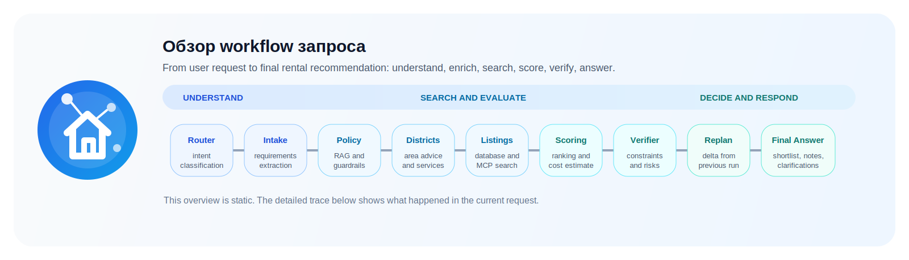

# Агент подбора аренды жилья и релокации

Учебный E2E-проект по агентам: relocation assistant с state graph orchestration, typed tool layer, RAG по policy-документам, детерминированным scoring, verifier/guardrails и replanning loop.

Проект сделан как понятный и расширяемый прототип для финальной работы: в нём специально разделены роли узлов, источники данных, проверка ограничений и визуализация работы пайплайна.

## Материалы под критерии

- Архитектура в `drawio`: [docs/relocation_agent_architecture.drawio](docs/relocation_agent_architecture.drawio)
- Функциональный flow в `drawio`: [docs/relocation_agent_functional_flow.drawio](docs/relocation_agent_functional_flow.drawio)
- Production contour в `drawio`: [docs/relocation_agent_production_contour.drawio](docs/relocation_agent_production_contour.drawio)
- Архитектура в `PlantUML`: [docs/relocation_agent_architecture.puml](docs/relocation_agent_architecture.puml)
- Разбор проекта по критериям и список оставшихся gap'ов: [docs/project_criteria_gap_analysis.md](docs/project_criteria_gap_analysis.md)
- Operating notes по `data freshness`, `auth`, `observability`: [docs/production_operating_model.md](docs/production_operating_model.md)
- Готовые demo-сценарии со скриншотами: [docs/demo_scenarios.md](docs/demo_scenarios.md)
- Реальный внешний MCP provider и пример shortlist: [docs/external_mcp_provider_example.md](docs/external_mcp_provider_example.md)
- Визуализация workflow для интерфейса: [src/app/assets/workflow_overview.svg](src/app/assets/workflow_overview.svg)

## Что умеет агент

- подбирать аренду по городу, бюджету, дате переезда, составу домохозяйства, животным, детям, меблировке, районам и commute;
- считать стартовые расходы: первый месяц, депозит, комиссия и move-in fees;
- объяснять, почему вариант подходит или не подходит;
- отвечать на info-вопросы по депозитам, коммунальным, районам, commute, страновым профилям и базовым правилам релокации;
- перестраивать shortlist, если изменились бюджет, дата, город, семья, питомцы или документный статус;
- эскалировать рискованные кейсы, например документные или квази-юридические запросы.

## Визуализация функционала



Что уже добавлено в визуализацию:

- верхнеуровневый flow запроса от сообщения пользователя до финального ответа;
- отдельная архитектурная схема в `drawio` без лишних деталей реализации;
- отдельная функциональная схема в `drawio`, которая показывает, как агент проходит через Router, Intake, RAG, поиск, scoring, verifier и replanning.

Обе `drawio`-схемы намеренно упрощены и держатся в пределах верхнеуровневых компонентов, чтобы их можно было использовать прямо в презентации.

## Почему это именно агент

Проект закрывает базовые признаки агентности:

- `Role`: разные узлы графа работают в разных ролях, а системные промпты у `router`, `intake`, `replanner` и `final_composer` различаются по задаче и ограничениям.
- `Reasoning`: агент не идёт по одному жёсткому `if-then`, а классифицирует intent, извлекает требования, пересобирает план поиска и меняет траекторию в зависимости от контекста.
- `Reflection`: `verifier` проверяет, соответствует ли результат ограничениям кейса, а `replanner` объясняет, что изменилось после follow-up.
- `Memory`: в `AgentSession` сохраняются `last_state`, `previous_requirements` и предыдущий shortlist, а во внешний профиль кейса пишутся `agent_case_memory`, `agent_run_history` и write-back в `client_preferences`.
- `Domain knowledge`: агент использует RAG по policy-документам и структурированные данные по городам, районам, кейсам и объявлениям.
- `Autonomy + Action`: агент сам вызывает инструменты, строит structured-запросы к tool layer и не запрашивает подтверждение на каждом промежуточном шаге.

## Ролевая модель решения

Задача сформулирована не как один большой prompt, а как набор ролей внутри orchestrated agent pipeline.

| Роль | Модуль | Что делает | Основная метрика |
|---|---|---|---|
| Router | `src/agent/router.py` | определяет intent сообщения | `intent_accuracy` |
| Intake Analyst | `src/agent/intake.py` | извлекает структурированные требования | `required_fields_extracted` |
| Policy Analyst | `src/agent/rag_policy.py` | поднимает policy-контекст и ограничения | косвенно влияет на `clarification_correctness` и `escalation_correctness` |
| District Advisor | `src/agent/district_advisor.py` | предлагает районы и сервисы релокации | качество shortlist и объяснений |
| Search Agent | `src/agent/listing_search.py` | получает кандидатов из SQLite/MCP | полнота candidate pool |
| Ranking Engine | `src/agent/scoring.py` | детерминированно ранжирует варианты | `budget_constraint_pass_rate`, `pet_constraint_pass_rate`, `upfront_cost_correctness` |
| Verifier | `src/agent/verifier.py` | проверяет ограничения, переводит кейс в `approved/clarification/escalation` | `clarification_correctness`, `escalation_correctness` |
| Replanner | `src/agent/replanner.py` | анализирует изменения требований | корректность follow-up логики |
| Final Composer | `src/agent/final_composer.py` | собирает человекочитаемый ответ | `recommendation_has_rationale` |

## Архитектура и ИТ-ландшафт

Верхнеуровневая архитектура разделена на шесть слоёв:

1. Точки входа: `CLI`, `Streamlit`, `QA runner`.
2. Оркестрация: `AgentGraph` и `RelocationAgent`.
3. Память: `AgentSession` + persistent case memory (`agent_case_memory`, `agent_run_history`, write-back в профиль кейса).
4. Инструменты: локальный DB tool layer, policy search, calculation tools, optional MCP listing adapters.
5. Знания и данные: `SQLite`, markdown policy corpus, reference/QA datasets.
6. Интеграции и подпитка данных: скрейпер `Krisha` / `List.am`, импорт в market schema, live MCP-провайдеры.

Архитектурная идея проекта:

- LLM используется только там, где нужна недетерминированность: intent classification, extraction, replanning analysis, final narrative.
- Поиск, scoring, cost calculation и constraint checking остаются кодом, чтобы сохранить воспроизводимость.
- Источники данных изолированы за typed adapters, поэтому локальную БД можно заменить внешним MCP без переписывания узлов графа.
- UI и eval runner работают поверх того же агента, а не поверх отдельных веток бизнес-логики.

Отдельно добавлен target production view:

- схема: [docs/relocation_agent_production_contour.drawio](docs/relocation_agent_production_contour.drawio)
- operating notes: [docs/production_operating_model.md](docs/production_operating_model.md)

Это не “ещё одна архитектурная картинка”, а отдельный ответ на вопрос, как система живёт в боевом контуре: где auth, где secret management, где freshness SLA и где observability.

## Системные промпты

Системные промпты уже есть в коде и вынесены по ролям:

| Узел | Где лежит | Назначение промпта |
|---|---|---|
| Router | `src/agent/router.py` | классифицировать сообщение в один из intent'ов: `info`, `search`, `replanning`, `budget_limit`, `preference_conflict`, `clarification`, `escalation` |
| Intake | `src/agent/intake.py` | извлечь только явно указанные требования, не придумывать значения, нормализовать pets и document status |
| Replanner | `src/agent/replanner.py` | проанализировать, как изменение требований влияет на shortlist и какие user-visible последствия появились |
| Final Composer | `src/agent/final_composer.py` | собрать ответ на русском языке, не выдумывать факты про объявления, учитывать warnings, clarification и escalation |

Почему это важно для защиты:

- видно, что проект не сводится к одному системному prompt;
- роли разведены по ответственности;
- ограничения безопасности и формата ответа описаны прямо в системных инструкциях.

## Данные и доступ к ним

### Что используется сейчас

- `data/relocation/relocation.sqlite` — operational SQLite для кейсов, клиентов, районов, городов, стран, сервисов и объявлений;
- `agent_case_memory` и `agent_run_history` внутри той же SQLite — persistent memory и история запусков;
- `data/documents/*.md` — policy corpus для RAG;
- `data/reference/*` — gold/reference для deterministic checks;
- `data/qa/qa.jsonl` — набор eval-сценариев;
- `data/relocation/krisha_listings.csv` и `data/relocation/krisha_normalized.sqlite` — следы реального market ingestion;
- `scraper/` — самописный сбор объявлений c `Krisha` и `List.am`.

### Что уже похоже на промышленный подход

- доступ к данным идёт не напрямую из графа, а через typed tool layer в `src/tools/*`;
- есть runtime-конфиг и отдельный registry для MCP-провайдеров;
- внешние объявления нормализуются в доменную модель `Listing`;
- persistent memory не только читается, но и делает write-back в профиль кейса и run history;
- есть `src/mcp_servers/*` как заготовка под вынос локальных инструментов в отдельные MCP-сервера.

### Что пока не production-grade

- нет полноценного SSO / RBAC / secret manager как готовой инфраструктуры;
- SQLite и markdown knowledge base подходят для прототипа, но не для промышленной нагрузки;
- обновление market data ещё не реализовано как централизованный scheduler с алертами;
- observability описана и декомпозирована, но не вынесена в отдельную платформу логов/метрик.

## Метрики качества

Метрики уже реализованы в `src/evals/metrics.py`, а batch-прогон находится в `src/evals/run_qa.py`.

| Метрика | Как считается | Target threshold | Тип |
|---|---|---|---|
| `intent_accuracy` | совпал ли intent агента с expected intent кейса | `>= 0.85` | soft |
| `required_fields_extracted` | доля критичных полей, извлечённых для recommendation/clarification кейсов | `>= 0.85` | soft |
| `budget_constraint_pass_rate` | не превышает ли top-1 вариант месячный бюджет | `>= 0.95` | hard |
| `pet_constraint_pass_rate` | учитываются ли pet-ограничения в top-1 варианте | `>= 0.90` | soft |
| `upfront_cost_correctness` | совпадает ли оценка стартовых расходов с reference | `>= 0.95` | hard |
| `expected_entities_accuracy` | упоминает ли ответ ожидаемые shortlist entities | `>= 0.75` | soft |
| `recommendation_has_rationale` | содержит ли финальный ответ объяснение “Почему подходит” и “Риски/компромиссы” | `>= 0.95` | hard |
| `clarification_correctness` | переведён ли кейс в `clarification`, когда это ожидается | `>= 0.90` | hard |
| `escalation_correctness` | корректно ли срабатывает `escalation` и handoff | `>= 0.90` | hard |
| `info_answer_has_sources` | есть ли ссылка/источник в info-ответе | `>= 0.80` | soft |

Минимальный quality gate:

- все hard metrics должны пройти;
- soft pass rate должен быть не ниже `75%`;
- запуск: `python3 -m src.evals.run_qa --enforce-gate`.

Текущий честный snapshot на `demo_stub`:

- `intent_accuracy = 0.55`
- `required_fields_extracted = 0.8769`
- `budget_constraint_pass_rate = 1.0`
- `pet_constraint_pass_rate = 1.0`
- `upfront_cost_correctness = 1.0`
- `expected_entities_accuracy = 0.6818`
- `recommendation_has_rationale = 0.7778`
- `clarification_correctness = 1.0`
- `escalation_correctness = 0.5`
- `info_answer_has_sources = 0.0`

Это важно для защиты: проект уже умеет не только считать метрики, но и честно фиксировать, проходит ли текущая реализация quality gate.

## Прототип и техническая готовность

Что уже реализовано end-to-end:

- `Streamlit`-интерфейс с чатом, sidebar по кейсам, трассировкой графа и шортлистом;
- `CLI`-режим для demo без UI;
- `QA runner` для batch-проверки на заранее подготовленных кейсах;
- deterministic tests по scoring, verifier, replanning, tools, runtime config и trace;
- optional LLM runtime через OpenRouter-compatible adapter;
- deterministic `demo_stub` backend для воспроизводимых demo;
- persistent memory + write-back path;
- config-driven MCP integration path для внешних провайдеров объявлений.

### Что можно показать на демонстрации

- поиск жилья под фиксированный кейс;
- explanation по топ-3 вариантам;
- replanning при изменении бюджета;
- clarification, если не хватает данных;
- escalation, если кейс выходит за границы безопасной автоматизации.

Готовые demo-артефакты:

- runbook и prompt-ы: [docs/demo_scenarios.md](docs/demo_scenarios.md)
- search screenshot: `docs/demo_assets/search_ui.png`
- replanning screenshot: `docs/demo_assets/replanning_ui.png`
- escalation screenshot: `docs/demo_assets/escalation_ui.png`

### Визуальные артефакты прототипа

- `src/app/assets/workflow_overview.svg` — картинка общего пайплайна;
- `docs/relocation_agent_functional_flow.drawio` — схема сценария “запрос -> shortlist -> ответ”;
- `docs/relocation_agent_architecture.drawio` — верхнеуровневая архитектура;
- `docs/relocation_agent_production_contour.drawio` — target production contour;
- в `Streamlit` есть экран “Как работал агент” с пошаговой трассировкой текущего запуска.

## Структура проекта

```text
config/
data/
  documents/
  qa/
  reference/
  relocation/

docs/

scraper/
  main.py
  scrapers/

src/
  agent/
  app/
  db/
  evals/
  mcp_servers/
  rag/
  tools/

tests/
```

## Как запустить

Установка зависимостей:

```bash
python3 -m venv .venv
source .venv/bin/activate
pip install -r requirements.txt
```

Основной runtime-config агента:

```bash
cp config/agent_runtime.example.json config/agent_runtime.json
```

Для воспроизводимого demo без внешней LLM:

```bash
cp config/agent_runtime.demo.example.json config/agent_runtime.json
```

Минимальный пример `config/agent_runtime.json`:

```json
{
  "llm_mode": "required",
  "llm_backend": "openrouter",
  "openrouter": {
    "api_key": "YOUR_OPENROUTER_API_KEY",
    "model": "deepseek/deepseek-v3.2",
    "app_title": "Relocation Agent Course Project",
    "http_referer": ""
  },
  "mcp": {
    "include_local_listings": true,
    "providers": []
  }
}
```

Создать или пересоздать БД:

```bash
python3 -m src.db.seed
```

Запустить `Streamlit`-интерфейс:

```bash
python3 -m src.app
```

или:

```bash
streamlit run app.py
```

Запустить `CLI`:

```bash
python3 -m src.app --cli
```

Запустить QA-eval:

```bash
python3 -m src.evals.run_qa
```

Запустить QA-eval c quality gate:

```bash
python3 -m src.evals.run_qa --enforce-gate
```

Запустить тесты:

```bash
pytest
```

## CLI и UI возможности

CLI:

- `/case R-0001` — загрузить кейс и начать диалог в его контексте;
- `/show` — показать текущий контекст;
- `/reset` — очистить сессию.

`Streamlit`:

- выбор учебного relocation case из sidebar;
- чат с агентом и быстрые промпты;
- окно `Как работал агент` с трассировкой узлов graph pipeline;
- вкладки с текущим состоянием агента и итоговым shortlist.

## Внешние MCP-провайдеры объявлений

Агент по умолчанию работает на локальной SQLite-базе и не зависит от внешних интеграций. Если рядом появляется MCP-провайдер, например `Cian` через hosted MCP от `Apify`, то `GraphDependencies` оборачивает локальный tool layer в composite-адаптер:

- локальные объявления сохраняются;
- внешние MCP-результаты подмешиваются в общий shortlist;
- ответы MCP нормализуются в текущую pydantic-модель `Listing`.

Подключение новых MCP делается в основном через конфиг, а не через переписывание graph nodes.

Отдельно задокументирован реальный live example:

- [docs/external_mcp_provider_example.md](docs/external_mcp_provider_example.md)

Что уже подтверждено на реальном provider:

- hosted MCP tool у `Apify` действительно доступен;
- live actor run успешно доводится до dataset fetch;
- карточки `Cian` нормализуются в общий shortlist format с `source:cian`.

## Ограничения, проблемы и развитие

### С какими проблемами столкнулись

- трудно совместить “агентность” и воспроизводимость, если всё делать только через LLM;
- для real estate кейса важно не только подобрать объект, но и не дать ложную уверенность в документных вопросах;
- реальные market данные шумные и быстро устаревают, поэтому потребовался отдельный слой нормализации;
- follow-up сценарии сложнее обычного single-turn search, потому что нужно сравнивать старые и новые ограничения.

### Текущие ограничения

- production auth / SSO / RBAC и централизованная observability пока только спроектированы;
- нет гарантии юридической актуальности страновых и migration-ответов;
- полный dialog graph зависит от structured LLM для router/intake/replanner/final composer;
- knowledge base пока lexical/in-memory, а не vector DB;
- live MCP provider остаётся внешней зависимостью и может быть нестабилен как hosted сервис.

### Что улучшать дальше

1. Довести target production contour до реального pilot-implementation: SSO, RBAC, secret manager, централизованные логи и алерты.
2. Поднять actual quality по router / escalation / narrative-метрикам до прохождения quality gate.
3. Заменить SQLite + markdown knowledge base на production data services и vector store.
4. Добавить online-метрики, latency tracing и dashboard по категориям кейсов.
5. Стабилизировать live MCP path и вынести freshness/health checks в отдельный scheduled layer.
