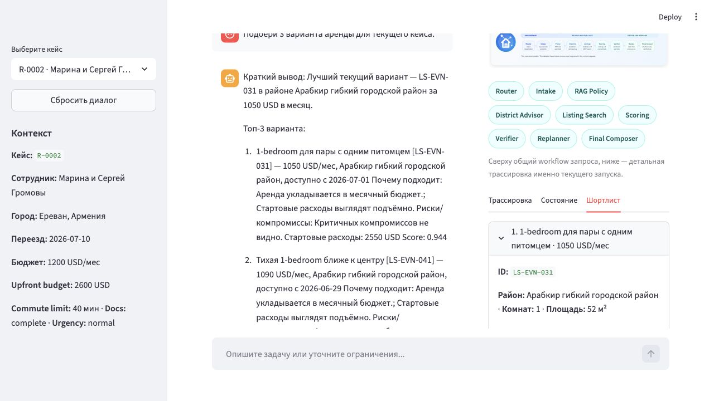
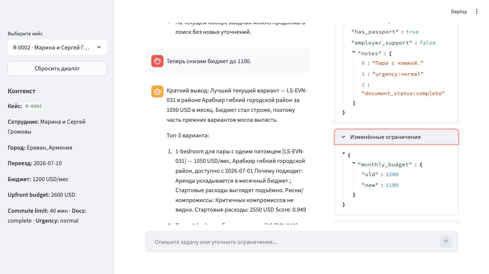
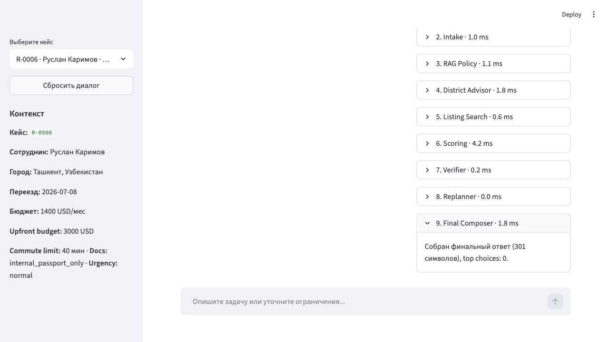

# Demo-сценарии и UI-скриншоты

Скриншоты ниже сняты 14 июня 2026 года на локальном `Streamlit` UI с `llm_backend=demo_stub`, чтобы demo была воспроизводимой и не зависела от внешней LLM.

Важно: в этих demo-кейсах не используется внешний live LLM backend. Мы запускаем локальный `demo_stub`, а сам shortlist строится обычным детерминированным пайплайном: агент находит кандидатов, ранжирует их и проверяет ограничения через `search`, `scoring` и `verifier`. Live `LLM backend` нужен в non-demo режиме для недетерминированных шагов вроде `router`, `intake`, `replanner` и сборки финального narrative-ответа, но не подменяет собой поиск объявлений.

## Как воспроизвести

```bash
AGENT_LLM_BACKEND=demo_stub AGENT_LLM_MODE=required python3 -m streamlit run app.py
```

## Набор demo-сценариев

| Сценарий | Кейс | Действие | Ожидаемый результат |
|---|---|---|---|
| `search` | `R-0002` | быстрый prompt `Подбери 3 варианта аренды для текущего кейса.` | агент строит shortlist и показывает top-3 |
| `replanning` | `R-0002` | follow-up `Теперь снизим бюджет до 1100.` | агент фиксирует changed constraints и пересобирает shortlist |
| `escalation` | `R-0006` | быстрый prompt `Подбери 3 варианта аренды для текущего кейса.` | verifier переводит кейс в `escalation` из-за document risk |

## Search

Что видно на экране:

- выбранный кейс `R-0002`;
- итоговый ответ с top-3 вариантами;
- вкладка `Шортлист` с карточкой лидирующего варианта.



## Replanning

Что видно на экране:

- intent переключился в `replanning`;
- `Verifier = approved`;
- во вкладке `Состояние` раскрыт блок `Изменённые ограничения`;
- месячный бюджет изменён c `1200` до `1100`.



## Escalation

Что видно на экране:

- выбран кейс `R-0006` c `document_status=internal_passport_only`;
- итоговый ответ не выдаёт shortlist как безопасную рекомендацию;
- пользователю предлагается human handoff и подготовка документов.



## Почему эти сценарии хороши для защиты

- `search` показывает happy path: intake -> search -> scoring -> shortlist;
- `replanning` показывает, что агент не забывает предыдущий run и понимает, что именно изменилось;
- `escalation` показывает ограничение автоматизации и наличие safety boundary.
